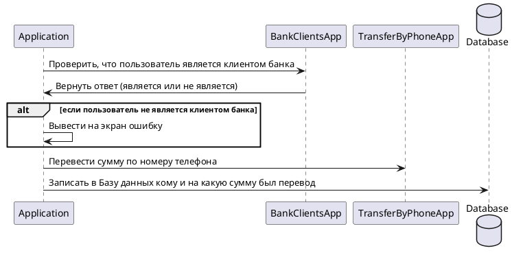

# Контекст Spring (Часть 2)

- [Презентация](https://docs.google.com/presentation/d/1ESgxmzR_KWfkr69wVps1rfwtfE-8FItVatsRALZTCP8/edit?usp=sharing)
- [Исходный код из лекции](https://github.com/ZuevKirill95/spring-practice-source-code/tree/main/spring-context-2)

## Домашнее задание

Создать проект, описанный в диаграмме.

- App - ваше приложение.
- BankClientsApp - стороннее приложение. Предоставляет информацию о клиентах банка.
- TransferByPhoneApp - стороннее приложение. Переводит денежные средства по номеру телефона
- DataBase - База данных вашего приложения. Хранит историю переводов.

BankClientsApp, TransferByPhoneApp и DataBase - это заглушки. Их не надо реализовывать.