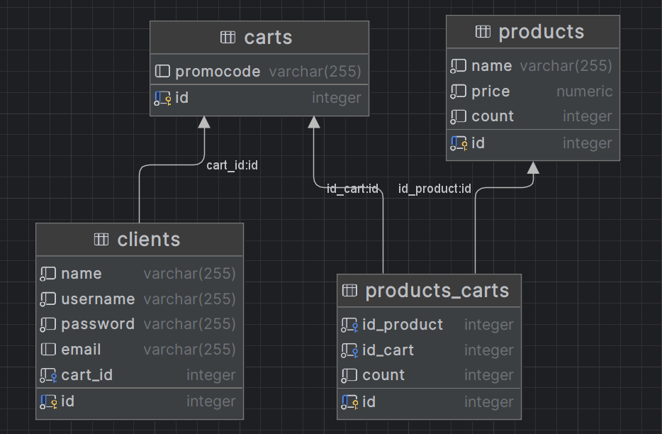

# JDBC

- [Исходный код из лекции](https://github.com/ZuevKirill95/spring-practice-source-code/tree/main/jdbc)

## Домашнее задание

1. Установить Базу Данных PosgreSQL https://www.postgresql.org/download/.
2. Создать таблицы в БД. Используйте готовые [SQL-скрипты](data.sql). Вместо _<схема>_ напишите
   _products_фамилия_инициалы_.
   Пример: `products_zuev_kd`

3. Модернизируйте предыдущее задание. Продукты, клиенты и корзины теперь должны храниться в БД.

### Примечания:

- Для подключения к БД используйте
  URL `jdbc:postgresql://localhost:5432/postgres?currentSchema=<cхема>&user=postgres&password=root`
